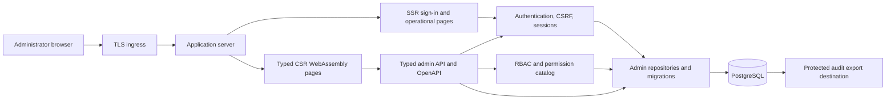

# Administrator architecture

The administrator console is part of the application service. It is not a separately deployed
trust boundary.

`server_admin_contract` owns transport wrappers, routes, permissions, page metadata, and OpenAPI
inputs. `server_admin_core` owns shared administrator domain policy. `server_admin` owns HTTP
handlers, repositories, migrations, authentication, authorization, audit, rate limiting, and
cleanup. `server_admin_frontend` owns SSR and CSR presentation. Shared service lifecycle and HTTP
policy remain in `server_runtime_core` and `server_runtime_http`.

PostgreSQL is the consistency boundary for identities, sessions, RBAC, settings, rate limits,
cleanup state, and append-only audit records. Multiple application replicas therefore share
session and rate-limit state; cleanup tasks must use the repository's database coordination rather
than process-local ownership.
